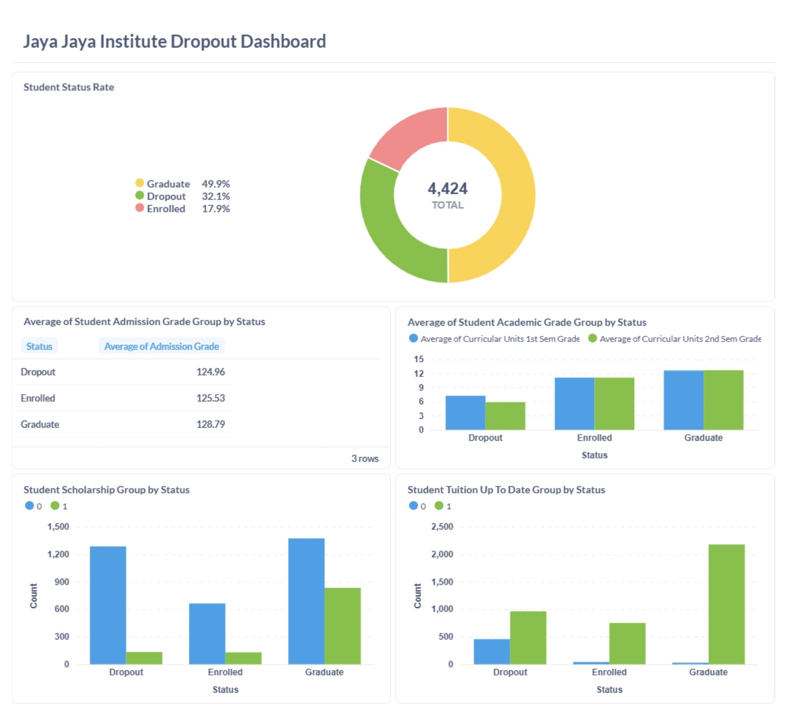

# Proyek Akhir: Menyelesaikan Permasalahan Institusi Pendidikan - Jaya Jaya Institute

## Business Understanding

Jaya Jaya Institut, sebuah institusi pendidikan tinggi yang telah berdiri sejak tahun 2000, telah menorehkan prestasi dengan mencetak banyak lulusan unggulan di berbagai bidang. Reputasinya yang kuat menjadikannya pilihan utama bagi banyak calon mahasiswa yang ingin meraih masa depan gemilang.

Namun di balik pencapaian tersebut, terdapat tantangan besar yang tak bisa diabaikan, yaitu fenomena tingginya angka mahasiswa yang tidak menyelesaikan pendidikannya atau biasa disebut dropout. Hal ini mencerminkan hambatan yang lebih dalam dalam sistem pendidikan, mulai dari proses seleksi, metode pembelajaran, hingga dukungan akademik yang mungkin belum optimal.

Tingginya tingkat dropout merupakan masalah yang serius bagi institusi pendidikan, karena tidak hanya berdampak pada angka kelulusan, tetapi juga berpengaruh langsung terhadap citra dan daya tarik Jaya Jaya Institut di mata calon mahasiswa baru. Tantangan ini menuntut perhatian strategis dan solusi yang berbasis data agar setiap mahasiswa memiliki peluang yang lebih besar untuk menyelesaikan pendidikannya dengan sukses.

### Permasalahan Bisnis

Jaya Jaya Institute menghadapi tantangan serius terkait tingginya angka mahasiswa yang mengalami dropout. Kondisi ini tidak hanya berdampak pada pencapaian akademik mahasiswa, tetapi juga berpotensi menurunkan citra institusi di mata calon mahasiswa baru. Saat ini, institusi belum memiliki sistem pemantauan yang mampu secara efektif mengidentifikasi mahasiswa yang berisiko tinggi dropout secara real-time. Kurangnya pemahaman mendalam terhadap faktor-faktor penyebab dropout menyulitkan institusi dalam mengambil langkah pencegahan yang tepat. Oleh karena itu, diperlukan solusi strategis untuk membantu meningkatkan retensi mahasiswa serta memastikan lebih banyak mahasiswa dapat menyelesaikan pendidikannya.

### Cakupan Proyek

Proyek ini bertujuan untuk mengembangkan solusi yang mampu membantu Jaya Jaya Institute dalam mengidentifikasi mahasiswa yang berisiko mengalami dropout. Ruang lingkup proyek meliputi analisis data historis mahasiswa, eksplorasi dan pemodelan faktor-faktor yang paling memengaruhi keputusan dropout, serta pembuatan sistem prediktif untuk mendeteksi potensi risiko secara real-time. Hasil dari proyek ini diharapkan dapat mendukung pengambilan keputusan dalam merancang kebijakan retensi mahasiswa yang lebih efektif dan proaktif.

### Persiapan

Sumber data: dataset yang digunakan merupakan dataset fiktif Students' Performance [Jaya Jaya Institute](https://raw.githubusercontent.com/dicodingacademy/dicoding_dataset/refs/heads/main/students_performance/data.csv).
Dataset ini memuat informasi dari institusi pendidikan tinggi, terkait dengan mahasiswa yang terdaftar dalam berbagai gelar sarjana, seperti agronomi, desain, pendidikan, keperawatan, jurnalisme, manajemen, layanan sosial, dan teknologi. Dataset tersebut mencakup informasi yang diketahui pada saat pendaftaran mahasiswa (riwayat akademik, demografi, dan faktor sosial-ekonomi) dan kinerja akademik mahasiswa pada akhir semester pertama dan kedua. Dataset ini sudah bersih sehingga tidak perlu untuk melakukan pembersihan data (data cleaning) dan siap digunakan untuk proses eksplorasi, pemodelan prediktif, serta pembuatan visualisasi interaktif.

Setup environment:
* Setup conda environment:
    ```
    conda create --name proyek-institusi-pendidikan python==3.9.15
    ```
* Install requirements:
    ```
    pip install -r requirements.txt
    ```
* Setup metabase:
    - Memanggil (pull) Docker image untuk menjalankan Metabase.
    ```
    docker pull metabase/metabase:v0.46.4
    ```
    - Menjalankan image.
    ```
    docker run -p 3000:3000 --name metabase metabase/metabase
    ```
    Akses metabase pada http://localhost:3000/setup dan lakukan setup.
* Setup database (supabase):

    * Siapkan env proyek untuk mengolah dataset yang akan digunakan
        ```
        pip install pandas sqlalchemy
        ```
    * Siapkan database
    * Buat akun dan login https://supabase.com/dashboard/sign-in.
    * Buat new project
    * Create a new project
    * Copy URI pada database setting, gunakan `Transaction Pooler` pada Connection String
    * Kirim dataset menggunakan sqlalchemy 
    ```python
    from sqlalchemy import create_engine
 
    URL = "DATABASE_URL"
    
    engine = create_engine(URL)
    df.to_sql('institute_dataset', engine)
    ```

## Business Dashboard

Dashboard ini bertujuan untuk membantu memberikan wawasan komprehensif kepada institut terhadap faktor-faktor yang berkontribusi dengan Status baik dropout, enrolled, ataupun graduated. Pada dashboard ini, tim institut dapat :
- Memantau tingkat dropout secara proaktif, memungkinkan institusi untuk secara cepat mendeteksi adanya kenaikan atau penurunan jumlah dropout, sehingga dapat mengambil tindakan yang tepat untuk mengurangi angka dropout.
- Menganalisis faktor-faktor kemungkinan mahasiswa dropout, seperti latar belakang akademik, nilai akademik, dan kondisi ekonomi mahasiswa berdasarkan biaya pendidikan.



## Menjalankan Sistem Machine Learning

Pada proyek ini telah disediakan juga prototype sistem untuk melakukan prediksi terhadap model kemungkinan mahasiswa dropout. Untuk menjalankan prototype ini, terdapat dua cara yaitu melalui lokal atau mengaksesnya melalui tautan Streamlit, dengan langkah -langkah sebagai berikut:
- Melalui lokal :
    1. Buka terminal dan arahkan ke direktori yang berisi file `app.py`
        ```
        cd path/to/destination/directory
        ```     
    2. Pastikan semua environment pada file `requirements.txt` telah terinstal, dengan menjalankan perintah berikut
        ```
        pip list
        ```
        Jika belum terinstall semua, install dengan perintah berikut
        ```
        pip install -r requirements.txt
        ```
    3. Jalankan perintah `streamlit run app.py`
    4. Setelah aplikasi berjalan, masukkan data yang sesuai pada form yang disediakan dan klik tombol "Predict" untuk mengetahui status mahasiswa tersebut.
- Melalui tautan Streamlit :
    Jika ingin menjalankan aplikasi melalui online tautan aplikasi, silakan mengunjungi tautan berikut : [Student Dropout Prediction](https://permasalahan-institusi-pendidikan-pds.streamlit.app/)

## Conclusion

Proyek ini dilaksanakan untuk menjawab tantangan utama yang dihadapi oleh Jaya Jaya Institute terkait tingginya angka mahasiswa yang mengalami dropout. Berdasarkan hasil analisis dan pemodelan prediktif menggunakan algoritma Random Forest, diperoleh sejumlah temuan penting sebagai berikut:

- Identifikasi Mahasiswa Berpotensi Dropout:
    Model prediktif yang dibangun mampu mengklasifikasikan status mahasiswa (dropout, enrolled, graduate) dengan akurasi yang cukup baik. Model ini memungkinkan institusi untuk mengidentifikasi secara real-time mahasiswa yang memiliki risiko tinggi mengalami dropout, berdasarkan kombinasi variabel akademik dan sosial ekonomi.

- Karakteristik Umum Mahasiswa Dropout:
    Mahasiswa yang cenderung dropout umumnya memiliki ciri-ciri seperti:
    - Nilai akademik rendah, dan jumlah SKS yang disetujui di semester awal.
    - Keterlambatan dalam pembayaran biaya kuliah (tuition fees not up-to-date).
    - Tidak menerima beasiswa meskipun berasal dari latar belakang ekonomi yang lemah.
    - Mahasiswa pindahan atau tergolong displaced students juga memiliki risiko yang lebih tinggi.

- Faktor Pendorong Dropout:
    Faktor paling berpengaruh terhadap dropout mencakup:
    - Akademik: Jumlah mata kuliah yang disetujui dan nilai pada semester awal.
    - Finansial: Ketertinggalan dalam pembayaran biaya kuliah dan tidak adanya dukungan beasiswa.
    - Sosial: Kondisi mahasiswa yang berpindah kampus atau berasal dari keluarga terdampak (displaced).


### Rekomendasi Action Items

Berikan beberapa rekomendasi action items yang harus dilakukan perusahaan guna menyelesaikan permasalahan atau mencapai target mereka.

1. Implementasikan Sistem Prediksi Pemantauan Dropout Mahasiswa.
- Menerapkan model prediktif yang telah dibangun untuk memantau siswa secara berkala. Institusi dapat menggunakan sistem ini untuk mendeteksi siswa yang berisiko tinggi untuk dropout dan memberikan intervensi dini yang lebih terarah dan efektif.

2. Tingkatkan Kualitas Layanan Konseling dan Pendampingan Belajar.
- Institusi harus memperkuat program dukungan konseling akademik dan psikologis, seperti peningkatan akses ke bimbingan belajar, hingga dukungan kesehatan mental bagi mahasiswa. Hal ini dapat menambah motivasi dan kemampuan mahasiswa untuk menyelesaikan pendidikan, serta mengetahui masalah yang dihadapi mahasiswa yang menghambat kemajuan akademik mereka.

3. Penyesuaian Kurikulum dan Pengembangan Program Studi.
Tinjau kembali program studi dengan tingkat dropout yang tinggi dan lakukan revisi terhadap kurikulum maupun metode pembelajaran. Seperti, menyesuaikan jadwal perkuliahan agar lebih fleksibel atau menyediakan materi tambahan sebagai pendukung pembelajaran dapat membantu mengurangi beban akademik yang dialami mahasiswa.

Dengan mengikuti rekomendasi ini, institute diharapkan dapat menurunkan tingkat dropout mahasiswa, meningkatkan retensi karyawan, dan dan memastikan lebih banyak siswa menyelesaikan pendidikannya.

Username: root@mail.com Password: root123
